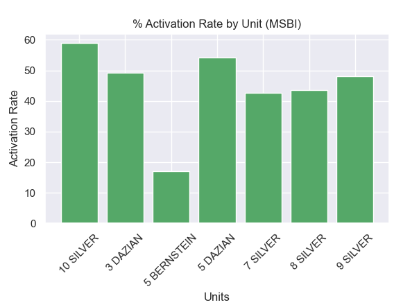

# XLSXtoCSVtoBARCHART_program

## Table of Contents

1. [Overview](#Overview)
2. [Product Spec](#Product-Spec)
3. [GIF](#GIF)

## Overview

**Goal**

To create a program to read data from an Excel data spreadsheet (.xlsx) and convert it to a Excel CSV file which is finally converted to a bar chart.

## Product Spec
- [x] Title of chart is displayed
- [x] X-Axis of chart is displayed
- [x] Y-Axis of chart is displayed
- [] Target line of chart is displayed

## GIF

